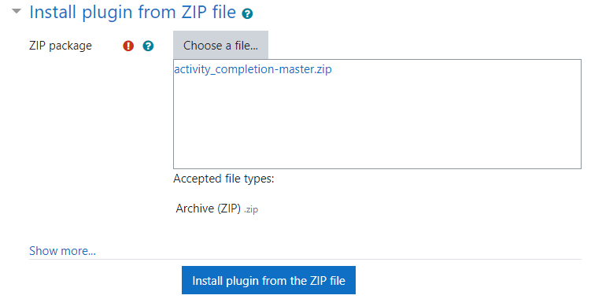
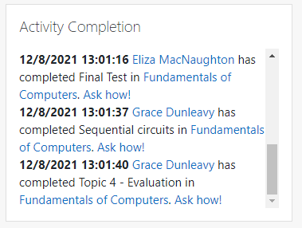

# Activity Completion Moodle Block

Moodle block which displays in the personal dashboard a global history/log of the users' activity completion, making the platform more engaging and showing who, when, and which activity has been completed, allowing the current user to ask them about it.

## Requirements

* Moodle 3.11+
* MySQL / MariaDB / PostgreSQL
* [Custom Course Module](https://github.com/alejandrobujan/course)

## Installation

Assuming the requirements of the previous section have been met, there are two main ways to install this plugin:

### Graphical installation

* Go to Site administration->Plugins->Install plugins 
* Import this plugin as a ZIP file, you can download it [here](https://github.com/alejandrobujan/activity_completion/archive/refs/heads/master.zip).

* Press "Install plugin from the ZIP file" button.

### CLI installation
In bash type the following commands:
```
cd blocks # Within your Moodle root
git clone https://github.com/alejandrobujan/activity_completion.git # Assuming you have installed Git tool
```
And then log in as admin user and go to Moodle notifications page if the installation wizard doesn't appear automatically.

## Usage

After installing the plugin, it can be directly used by users and can be added to the personal dashboard. Every time an user mark an activity as done, a notification will appear in the block!


## Theme support

This plugin is developed and tested on Moodle Core's Boost theme and Academi theme. It should also work with Boost child themes, including Moodle Core's Classic theme. However, we can't support any other theme than Boost and Academi.

## Bug and problem reports

This plugin is carefully developed and thoroughly tested, but bugs and problems can always appear. We will do our best to solve problems, but please note that due to limited resources we can't always provide per-case support.


